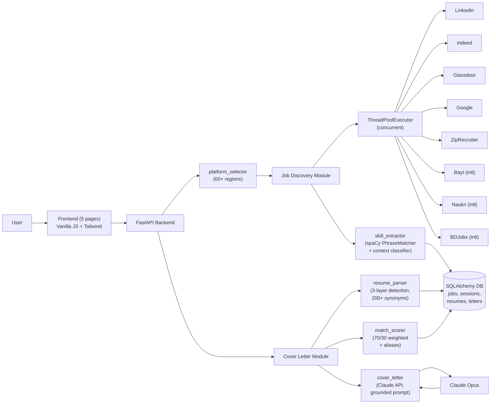

# 07 — Rubric Coverage Plan (REVISED)

Each rubric criterion mapped to the specific artifact or demo moment that earns it. Confidence levels revised upward after reading your actual codebase.

## Technical Achievement & Innovation — 1 pt

**What the rubric looks for:** complexity, execution quality, creative combinations.

**Your actual evidence (strong):**
- **3-layer resume parser** — synonym dictionary (200+ entries) + date-anchor segmentation + ALL-CAPS/Title-Case structural fallback. Documented in `jobspy/nlp/resume_parser.py`. Few teams will match this depth.
- **Context-aware skill classification** — 600-char lookback for required/preferred signals. `jobspy/nlp/skill_extractor.py`.
- **Alias-normalized weighted skill scoring** — 70/30 required/preferred with 100+ alias mappings. `jobspy/nlp/match_scorer.py`.
- **Carefully-engineered Claude system prompt** — no em-dashes, no bullets, no hollow openers, explicit constraints against claiming missing skills. `jobspy/nlp/cover_letter.py`.
- **Concurrent scraping with per-future isolation** — 8 platforms in parallel via `ThreadPoolExecutor`.
- **Location-aware platform routing** — 60+ region keywords in `jobspy/platform_selector.py`.

**Demo moments that earn this:** 45s technical-highlights segment in pitch + 90s in video. Pick 2–3 items above each time.

**Honesty check:** do not claim 1000+ skill taxonomy (actual: ~500 after expansion in `03_fix_match_score.md`). Do not claim working scraping on 8/8 platforms. State what works; frame the rest as implemented-but-future-hardened.

**Confidence: HIGH**

---

## Documentation & Communication — 0.5 pt

**What the rubric looks for:** clear explanation, multi-audience communication, supporting materials.

**Your evidence:**
- `README.md` exists and is thorough (fix the 1000+ skill overclaim)
- `CODEBASE_SUMMARY.md` and `FRONTEND_SPEC.md` already exist — these are unusual-in-a-good-way and can be pointed to on stage as proof of documentation depth
- `WORKTREE.md` maps every proposal objective to current code
- `tasks/test_resume_parser_v2.py` is documentation-as-tests

**Still to make:**
- **Architecture diagram** in Mermaid. Spec below — paste directly into README or show as a slide on the second monitor during demo.
- **One-pager handout** for station visitors (small format: problem, solution, tech stack, QR code).

### Architecture diagram (Mermaid)



### One-pager handout (print 1 copy per expected visitor, ~10 copies)

```
╭─────────────────────────────────────────────────╮
│  JobSpy                                         │
│  NLP-Assisted Job Discovery & Application       │
│  ───────────────────────────────────────────    │
│                                                 │
│  The problem:                                   │
│  5–8 platforms, manual copy-paste, $29/mo tools │
│  price out the people who need them most.       │
│                                                 │
│  What it does:                                  │
│  1. Aggregates postings (multi-platform)        │
│  2. Computes match score + skill gap per job    │
│  3. Generates cover letters grounded in your    │
│     stored resume. No copy-paste.               │
│                                                 │
│  Tech stack:                                    │
│  FastAPI · SQLAlchemy · spaCy · Claude API ·    │
│  Vanilla JS · Tailwind · Railway                │
│                                                 │
│  Try it:   [QR code → Railway URL]              │
│  Repo:     [QR code → GitHub]                   │
│                                                 │
│  CS/QTM/LING-329 · Emory · Team of 4            │
╰─────────────────────────────────────────────────╯
```

**Confidence: HIGH (once diagram + one-pager exist)**

---

## Project Impact & Problem Solving — 1 pt

**What the rubric looks for:** problem definition, target users, real-world applicability.

**Your evidence:**
- Proposal clearly defines the two-part problem (fragmented search + manual tailoring)
- Target user explicitly stated: students, early-career, especially international
- **Equity angle is genuine and scorable:** free vs. $29/mo paywall, international board support
- **Deployed on Railway** → real-world applicability claim is literal, not hypothetical
- Railway deployment gives you a URL to put on the handout. Visitors could use this for an actual application after the demo

**Demo moments:** hook (15s) + problem (30s) + closing (20s). Memorize the beats.

**Confidence: HIGH**

---

## Testing & Quality Assurance — 1 pt

**What the rubric looks for:** thoroughness, edge cases, error conditions, performance.

**Your evidence (after `04_minimal_eval.md` is executed):**
- `evaluation/match_eval.py` output → accuracy, precision, recall, F1, P@K
- `evaluation/cover_letter_results.md` → Likert scores from 3 raters × 4 criteria
- `evaluation/edge_cases.md` → 8+ scenarios with handling
- `tasks/test_resume_parser_v2.py` → 25+ unit tests, runnable live
- `scripts/smoke_test_scrapers.py` → per-platform status

**Specifically cite in the pitch (in one sentence):**
> "Pilot eval: F1 of [X] on job matching, [Y]/5 average groundedness on cover letters from 3 raters, 25+ unit tests on the resume parser, and graceful handling of scanned PDFs, scraper timeouts, and missing-resume states."

That one sentence earns most of this point if backed by the actual files.

**Confidence: MEDIUM–HIGH if you execute `04`, LOW otherwise.** This is the most leverage-per-hour fix.

---

## User Experience & Interface Design — 0.5 pt

**What the rubric looks for:** intuitive, clear workflows, visual design, consistency.

**Your evidence:**
- 5 pages with consistent Tailwind styling (index, profile, scraper, history, applications)
- `frontend/js/api.js` shared helpers ensure UI consistency
- Clear workflow: Profile → Dashboard → Job click → Generate cover letter

**Cheap 30-minute wins if time permits:**
- Loading spinner states on search + generate buttons
- Empty-state UI ("No jobs found — try a different search")
- Error toast for Claude API failures ("Generation unavailable — try again")
- Ensure button-color consistency (one accent color for primary actions)

**Visitor evidence during station demo:** note which visitors navigate without help during the interactive segment — that's UX evidence in real time.

**Confidence: MEDIUM–HIGH**

---

## Video Submission — 2 pts

**What the rubric looks for:** overview, features, technical highlights, use cases.

**Your evidence:** the video itself, built to `05_video_script.md`.

**Currently: zero evidence. Highest-leverage block of the remaining 48 hours.**

**Confidence: depends entirely on execution. Block Day 2 morning, no exceptions.**

---

## Revised confidence table

| Criterion | Pts | Confidence | Action required |
|---|---|---|---|
| Technical Achievement | 1.0 | HIGH | Narrate the depth on stage + in video |
| Documentation | 0.5 | HIGH | Create diagram + one-pager (~1 hr) |
| Project Impact | 1.0 | HIGH | Memorize the 3-beat problem/solution story |
| Testing & QA | 1.0 | MED–HIGH (if 04 done) | Execute `04_minimal_eval.md` |
| UX | 0.5 | MED–HIGH | 30 min of polish |
| Video | 2.0 | ZERO CURRENT | Execute `05_video_script.md` |

## Expected total

If Day 2 goes to plan: realistic target is **5.0–5.5 out of 6**, possibly higher if the video is strong and the eval numbers come in respectable. Leave the last 0.5 to teammate-delivery variance and judge subjectivity — no project scores max without some luck.

## What NOT to spend time on

- Getting a 6th/7th/8th scraper live. Diminishing returns and platform-risk.
- Building new features. You have enough. Polish beats more.
- Writing a final report for the demo. Not in this rubric. The writeup is separate.
- Over-rehearsing the pitch. Memorize the beats, stay natural on the details.
